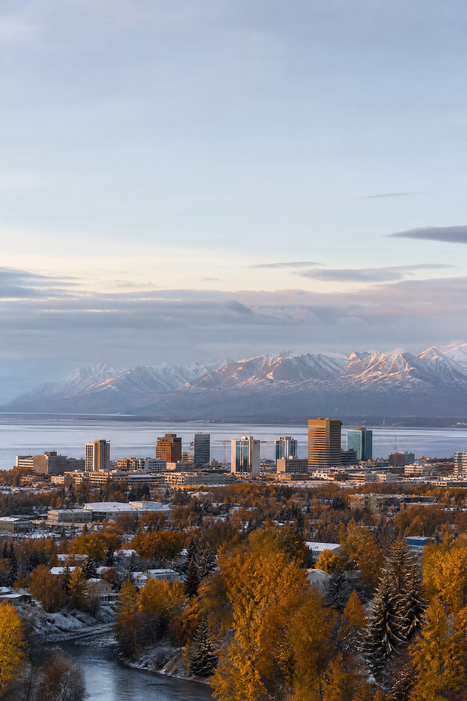

# ANCHORAGE VIEW

## The city at the edge of change

### September 2026 · Issue 01

**Ten reported stories about the decisions, pressures, and possibilities shaping Anchorage now.**

> **Editorial note**
>
> Anchorage View is an original magazine-style compilation prepared from publicly available reporting and official documents. It is not affiliated with the cited news organizations or the Municipality of Anchorage. Facts are attributed in the text; analysis and transitions are editorial framing by **Manus AI**.

---

## Contents

| Section | Story | Page |
|---|---|---:|
| City Hall | 1. A hard budget conversation begins | 4 |
| Growth | 2. JBER’s proposed build-out arrives with a housing question | 6 |
| Housing | 3. The camps are smaller; the challenge is not | 8 |
| Infrastructure | 4. Anchorage’s billion-dollar water problem | 10 |
| Public safety | 5. A standoff ends with a fatal police shooting | 12 |
| Neighborhoods | 6. The next fight over how Anchorage grows | 14 |
| Education | 7. A new school year, under familiar pressure | 16 |
| Mobility | 8. A trail connection links downtown to a bigger vision | 18 |
| Civic life | 9. Vote centers turn access into a local issue | 20 |
| Community | 10. A native garden takes root on Government Hill | 22 |

---

# 1 · A hard budget conversation begins

### Anchorage’s 2027 planning cycle opens with stable-looking revenue, rising costs, and fewer easy choices.

By **Anchorage View staff**

Anchorage’s next budget season began with a warning that sounded less like a forecast than a boundary line: the city may be able to hold revenue relatively steady, but it cannot keep every promise at the same scale. Mayor Suzanne LaFrance’s Sept. 2 preliminary budget memo starts the formal 2027 process, while municipal officials acknowledge that the size of any deficit is not yet known. [1] [2]

The early numbers point to pressure rather than collapse. The municipality’s memo projects a $3 million decrease in non-property-tax revenues subject to the tax limit and roughly $7.8 million less in other revenues than the amount budgeted for 2026. Officials emphasize that these are preliminary figures and that final calculations will arrive with the proposed budget. [1]

That distinction matters because Anchorage’s budget is being pulled in several directions at once. The administration says it wants to continue investing in public safety, housing, behavioral-health response, neighborhood revitalization, and aging infrastructure. The Assembly, meanwhile, has asked for realistic expectations about services and for a focus on projects that prevent catastrophic failures rather than add new maintenance obligations. [1] [2]

The timeline is now part of the story. The Assembly is scheduled to hold a work session on the 120-day memo on Sept. 18, with a draft budget due Oct. 2. The decisions that follow will translate abstract projections into the things residents notice first: road work, public safety capacity, schools, parks, housing programs, and the price of keeping the city functioning.

> **The figure to watch:** Preliminary 2027 estimates include about $3 million less in non-property-tax revenue subject to the tax limit and about $7.8 million less in other revenues than 2026 budgeted revenue. [1]

**Why it matters:** Anchorage’s fiscal debate is becoming a debate about priorities under constraint—not merely about finding a single missing pot of money.

---

# 2 · JBER’s proposed build-out arrives with a housing question

### A potential $7 billion military construction program could bring jobs, buildings, and thousands of new neighbors.

By **Anchorage View staff**

The biggest economic story on Anchorage’s horizon may be unfolding behind the gates of Joint Base Elmendorf-Richardson. Reporting from the Anchorage Daily News describes a “Fightertown Recapitalization” program that could channel nearly $7 billion into new or modernized facilities over several years. Construction could begin as soon as summer 2027, although the federal authorization process is not complete. [3]

The proposed work includes hangars, dormitories, warehouses, airfield improvements, training infrastructure, utility extensions, and other mission facilities. A Senate committee version of the fiscal 2027 defense bill included about $2.066 billion for the JBER program, while Air Force budget documents described a longer-term total of approximately $6.964 billion. [3]

For Anchorage, the opportunity is both direct and indirect. New construction would mean contracts, subcontracting, and demand for services. Military projections also point to roughly 2,500 additional personnel associated with the recapitalization effort. That creates a second question, one that cannot be solved with a ribbon-cutting: where will those workers and families live? [1] [3]

The city’s own budget memo frames the program as an economic opportunity and a housing challenge. Anchorage is already trying to accelerate the production of 10,000 homes in 10 years, while construction costs and limited inventory make large-scale growth difficult. If the military investment arrives on schedule, the city will be asked to expand capacity quickly without overextending its infrastructure. [1]

**Why it matters:** JBER’s expansion could strengthen Anchorage’s economy, but its success will be measured partly by whether the city can absorb growth without making housing and public-service pressures worse.

---

# 3 · The camps are smaller; the challenge is not

### Anchorage reports progress on visible homelessness while shelter capacity and street-level need remain unresolved.

By **Anchorage View staff**

Anchorage’s homelessness story has changed shape. A federally mandated point-in-time survey recorded a 28% drop in the number of people living outside, and the city says the large, entrenched camps that once occupied prominent parks and trail corridors have receded. [4]

But a smaller footprint is not the same as a solved problem. The Anchorage Daily News reported that smaller camps remain, often farther from view and deeper in the woods. City officials say the municipality had about 300 shelter beds available for the summer, down from roughly 450 during winter, and that demand still exceeds supply. [4]

The numbers also carry definitions that deserve attention. The city’s count of outdoor deaths, for example, excludes several categories of death, including homicides and deaths that occur in hospitals. Officials maintain that the same criteria have been used, while critics question whether the metrics fully capture what is happening beyond the most visible camps. [4]

The result is a complicated civic picture. Clearing camps can reduce hazards and restore access to public spaces. Shelter can create a safer bridge to treatment and housing. Yet when people move from large camps into smaller, less visible places, the underlying causes—housing costs, behavioral-health crises, addiction, disability, and a shortage of supportive options—do not move with them.

**Why it matters:** Anchorage may be making measurable progress on unsheltered homelessness, but the city still has to prove that visibility has not simply been replaced by dispersal.

---

# 4 · Anchorage’s billion-dollar water problem

### Stormwater is not an abstract utility issue when it becomes a sinkhole, a flooded home, or a broken road.

By **Anchorage View staff**

Anchorage’s stormwater system is old, fragmented, and expensive to repair. A May briefing to the Anchorage Assembly put the municipality’s unaddressed stormwater-related liability at roughly $1.3 billion. The city has about 590 miles of storm pipes, and more than 400 miles—about 68%—were described as being in a state of collapse. [5]

In Anchorage, “stormwater” includes more than rain. Snowmelt and runoff descend from the Chugach Mountains through a city built across a network of watersheds. When pipes, culverts, and drainage structures fail, the consequences can show up as flooded property, polluted waterways, deteriorating pavement, or emergency repairs that cost more than preventive maintenance would have. [5]

The city’s institutional problem is as important as the engineering problem. No single existing utility or government entity has clear responsibility for the entire stormwater system. Roads, subsurface drainage, and water infrastructure can fall under different jurisdictions, leaving gaps where routine inspection and maintenance should be. [5]

A stormwater utility has been proposed before. An advisory commission paused its work in 2021 and resumed meeting in 2026. The debate ahead will involve rates, service boundaries, public accountability, and the basic question of whether Anchorage is willing to pay steadily for maintenance rather than pay episodically for failure.

> **The infrastructure dilemma:** “We’ll fix it one year but we’re there three years later fixing it again,” municipal staff told the Assembly. [5]

**Why it matters:** Water is one of the most ordinary forces in Anchorage—and one of the costliest when the city has no durable system for managing it.

---

# 5 · A standoff ends with a fatal police shooting

### Officials say more information will follow as Anchorage examines a deadly confrontation at a downtown housing facility.

By **Anchorage View staff**

A standoff at the Adelaide, a housing facility for formerly homeless residents, ended Aug. 18 with an Anchorage police officer shooting and killing a woman, according to Alaska Public Media’s account of a police briefing. Police Chief Sean Case said the woman had pointed a gun at staff and officers and had threatened suicide. [6]

Case said police spent more than an hour attempting to negotiate. The response included the department’s Mobile Intervention Team, SWAT officers, crisis negotiators, a drone, and officers positioned outside the third-floor unit. He said the fatal shot was fired by one officer, who had not yet been interviewed when the chief gave his preliminary account. [6]

The incident unfolded near an elementary school shortly before the start of the school year, adding a layer of public concern to a confrontation already involving a housing facility and a behavioral-health crisis. Police said the woman was pronounced dead at the scene. Her name and the officer’s name were not publicly released in the report. [6]

The case will turn on what investigators learn about the sequence of decisions, the perceived threat, the available alternatives, and the review process that follows. A preliminary account is not a final finding. That distinction is essential in any fatal use-of-force case, especially one involving crisis response and a resident population that already lives at the intersection of housing instability, trauma, and public safety.

**Why it matters:** The shooting will test Anchorage’s crisis-response system and the public’s ability to evaluate police action before the full investigative record is available.

---

# 6 · The next fight over how Anchorage grows

### A revised zoning proposal seeks more housing near transit while neighborhood groups ask for more time and more detail.

By **Anchorage View staff**

Anchorage’s long-running argument over density has a new name. The Assembly proposal once known as the Transit Supportive Development Overlay was recast as the **Missing Middle Housing Opportunity overlay**, or MMHOP. Sponsors planned to introduce the seventh version in June and hold a public hearing in September. [7]

The concept is straightforward even if the politics are not: make it easier to build duplexes, small multifamily buildings, and other “missing middle” forms of housing near transit and in areas identified for growth. Supporters say the current rezone process can take at least a year, involve extensive paperwork and public hearings, and make modest projects financially unworkable. [7]

Opponents and skeptical community councils have not rejected the goal of more housing outright. Their concerns focus on the details: building height, sunlight, parking, traffic, neighborhood character, and whether residents have had a meaningful chance to respond as the proposal changes. [7]

The policy is therefore a test of process as much as land use. Anchorage needs more homes, particularly for working families, young professionals, elders, and people who want to remain in their neighborhoods. It also needs public rules that are clear enough to earn trust. A city cannot build its way out of a housing shortage if every project begins with uncertainty about what the rules mean.

**Why it matters:** MMHOP asks Anchorage to choose between preserving a familiar pattern of low-density neighborhoods and making room for a broader range of homes close to services and transit.

---

# 7 · A new school year, under familiar pressure

### Anchorage students returned to classrooms in August as the district and city continued navigating funding and calendar questions.

By **Anchorage View staff**

The 2026–27 school year brought the most visible sign of continuity a city can offer: students returning to Anchorage classrooms. Alaska’s News Source reported that students in grades 1 through 12 entered schools on Aug. 20, beginning another year across a district serving a large and diverse municipality. [8]

Behind the opening-day photographs is a more complicated public-finance story. Anchorage’s 2027 budget memo says the municipality intends to fund the maximum voluntary contribution allowed for the Anchorage School District, but the eventual amount depends on state law, district figures, and the city’s own revenue outlook. [1]

The memo estimates that the required local contribution could be about $138 million for the next school year, while the maximum voluntary contribution may be around $108 million—figures that officials say can change as the state Legislature, the district, and the municipality complete their respective budget processes. [1]

For families, school funding debates are not merely fiscal. They can shape staffing, programs, transportation, building maintenance, and the stability of the school calendar. The year begins with students in their seats; the larger question is whether the institutions around them can provide a predictable foundation.

**Why it matters:** Anchorage’s school-year story is also a story about the limits of local control when education funding is shaped by municipal revenue, state policy, and district needs at the same time.

---

# 8 · A trail connection links downtown to a bigger vision

### A long-sought Coastal–Ship Creek link would close a gap in Anchorage’s trail network and extend a signature loop.

By **Anchorage View staff**

Anchorage is moving ahead with a long-sought connection between the Coastal and Ship Creek trails, according to reporting by the Anchorage Daily News. The project would extend the paved route known locally as the 32-mile “Moose Loop” and create a stronger link between downtown and the future Alaska Long Trail. [9]

Trail projects are often described as recreation investments, but their civic value is broader. A connected route can support commuting, tourism, exercise, neighborhood access, and the kind of low-cost mobility that does not depend on a car. In a city where geography can make short trips feel surprisingly disconnected, a missing segment can have an outsized effect.

The project also fits a larger Anchorage question: how should growth be experienced at street level? New military investment, housing construction, and neighborhood redevelopment will add pressure to roads and parking. A trail connection cannot solve that alone, but it can give residents another way to reach work, the waterfront, parks, and one another.

The link’s importance will be measured in daily use rather than in its opening ceremony. If downtown workers, families, visitors, and cyclists can move through the city with fewer breaks in the network, Anchorage will have gained more than a trail segment—it will have gained a piece of connective tissue.

**Why it matters:** In a city built around distance, a short piece of infrastructure can change how people understand the whole place.

---

# 9 · Vote centers turn access into a local issue

### Anchorage’s municipal election brought attention to where, when, and how residents cast a ballot.

By **Anchorage View staff**

Ahead of Anchorage’s April 7 municipal election, vote centers opened with weekday hours and a Saturday schedule, according to the Anchorage Daily News. The arrangement put election access in practical terms: a resident’s ability to vote can depend on location, work schedule, transportation, and whether the process feels understandable. [10]

Municipal elections may attract less national attention than state or federal contests, but their effects are immediate. Anchorage voters choose leaders who influence zoning, roads, public safety, education contributions, parks, housing policy, and the city’s tax-and-service balance. The ballot is local; the consequences are visible in everyday life.

The value of vote centers is not only convenience. They can also serve as public infrastructure for trust when voters know where to go, when the sites are open, and what identification or ballot process to expect. Clear information becomes especially important in a city where residents may live far from downtown or work hours that do not fit a traditional election-day schedule.

As Anchorage continues to debate how much government can do—and how much residents are willing to pay for—participation becomes part of the policy story. Access is not a guarantee of turnout, but it is one of the conditions that makes turnout possible.

**Why it matters:** Local democracy is built out of ordinary logistics. A vote center is a building, a schedule, and a reminder that civic power needs a route to reach people.

---

# 10 · A native garden takes root on Government Hill

### Volunteers’ work at Susan Nightingale McKay Park offers a small-scale picture of community resilience.

By **Anchorage View staff**

On Aug. 27, dozens of volunteers gathered at Susan Nightingale McKay Park in Government Hill to plant an edible native garden, according to Alaska’s News Source. The project is modest beside Anchorage’s billion-dollar infrastructure debates and multi-year construction proposals, but its meaning is local and tangible. [11]

A community garden can turn a public space into a place of participation. It asks residents to contribute time, learn what grows in the region, and think about a park as something cultivated rather than merely maintained. An edible native garden also connects food, ecology, and neighborhood identity in a way that a conventional beautification project may not.

The timing is notable. Anchorage is entering a period of intense discussion about growth, public services, housing, and the future of its neighborhoods. Large systems will shape the city, but smaller projects can determine whether residents feel they have a role within those systems. A garden is not a substitute for a shelter bed, a repaired storm pipe, or a funded classroom. It is a different kind of civic work.

The most durable local stories often begin this way: with people showing up, improving a shared space, and making a place easier to recognize as their own.

**Why it matters:** Community resilience is not only an emergency response. It is also the slow practice of creating places where people can belong.

---

## Anchorage View at a glance

| Theme | What the reporting shows |
|---|---|
| Fiscal capacity | Anchorage’s 2027 budget cycle begins with projected revenue pressure and rising service expectations. |
| Growth | JBER investment could bring major construction and new residents, increasing the need for housing. |
| Housing and homelessness | Visible camping has declined, but shelter capacity and underlying causes remain unresolved. |
| Infrastructure | Stormwater failures represent a roughly $1.3 billion liability and expose gaps in maintenance responsibility. |
| Public safety | A fatal police shooting during a crisis response remains under investigation. |
| Neighborhood form | A revised overlay proposal would make more types of housing possible near transit and in selected areas. |
| Civic life | Schools, trails, vote centers, and gardens show how city policy becomes daily experience. |

---

## Editor’s note

Anchorage is often described through its extremes: distance, weather, military importance, outdoor grandeur. The stories in this issue point toward a quieter definition of the city. Anchorage is also a set of systems under negotiation—budgets, pipes, shelters, classrooms, trails, zoning codes, and public spaces. Each system is local enough to touch directly and large enough to outlast a single news cycle.

The city’s next chapter will not be written by one project or one election. It will be built through a sequence of choices about what to maintain, what to expand, what to measure, and who gets heard before the decision is final.

— **Manus AI**

---

## References

[1] [Municipality of Anchorage, “2027 Preliminary Data – 120 Day Memo,” Sept. 2, 2026](https://www.muni.org/Departments/budget/operatingBudget/2027%20GGOB/2027%20120%20Day%20Memo%20Signed%20by%20the%20Mayor.pdf)

[2] [Anchorage Daily News, “Anchorage city leaders prepare for ‘tough choices’ during upcoming budget cycle,” Sept. 5, 2026](https://www.adn.com/alaska-news/anchorage/2026/09/05/anchorage-city-leaders-prepare-for-tough-choices-during-upcoming-budget-cycle/)

[3] [Anchorage Daily News, “JBER could see $7B in the coming years, money officials think could boost Anchorage’s economy,” Aug. 16, 2026](https://www.adn.com/alaska-news/military/2026/08/16/jber-could-see-7b-in-the-coming-years-money-officials-think-could-boost-anchorages-economy/)

[4] [Anchorage Daily News, “‘Hiding better’: A complicated reality as Anchorage says it’s making progress on persistent homelessness,” June 6, 2026](https://www.adn.com/alaska-news/anchorage/2026/06/06/hiding-better-a-complicated-reality-as-anchorage-says-its-making-progress-on-persistent-homelessness/)

[5] [Anchorage Daily News, “Anchorage Assembly gets preview of $1.3B infrastructure liability that keeps worsening,” May 24, 2026](https://www.adn.com/alaska-news/anchorage/2026/05/24/anchorage-assembly-gets-preview-of-13b-infrastructure-liability-that-keeps-worsening/)

[6] [Alaska Public Media, “Woman dead after Anchorage police officer fires single shot in standoff, police chief says,” Aug. 18, 2026](https://alaskapublic.org/news/public-safety/2026-08-18/woman-dead-after-anchorage-police-officer-fires-single-shot-in-standoff-police-chief-says)

[7] [Anchorage Daily News, “Anchorage Assembly resurrects zoning policy under new name, with changes,” June 2, 2026](https://www.adn.com/alaska-news/anchorage/2026/06/02/anchorage-assembly-resurrects-zoning-policy-under-new-name-with-changes/)

[8] [Alaska’s News Source, “‘A lot of energy’: Students 1st–12th grade enter Anchorage School District classrooms,” Aug. 20, 2026](https://www.alaskasnewssource.com/2026/08/20/lot-energy-students-1st12th-grade-enter-anchorage-school-district-classrooms/)

[9] [Anchorage Daily News, “Anchorage will build long-sought link between Coastal and Ship Creek trails,” May 13, 2026](https://www.adn.com/alaska-news/anchorage/2026/05/13/anchorage-will-build-long-sought-link-between-coastal-and-ship-creek-trails/)

[10] [Anchorage Daily News, “Anchorage vote centers open Tuesday for April 7 municipal election,” Mar. 30, 2026](https://www.adn.com/alaska-news/anchorage/2026/03/30/anchorage-vote-centers-open-tuesday-for-april-7-municipal-election/)

[11] [Alaska’s News Source, “Volunteers plant native garden at Anchorage park,” Aug. 27, 2026](https://www.alaskasnewssource.com/2026/08/27/volunteers-plant-native-garden-anchorage-park/)

*Cover image: AI-generated editorial illustration prepared for Anchorage View; no claim is made that it depicts a specific date or event.*
